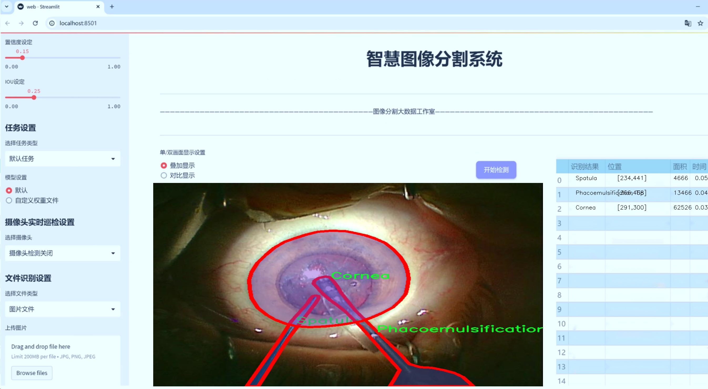
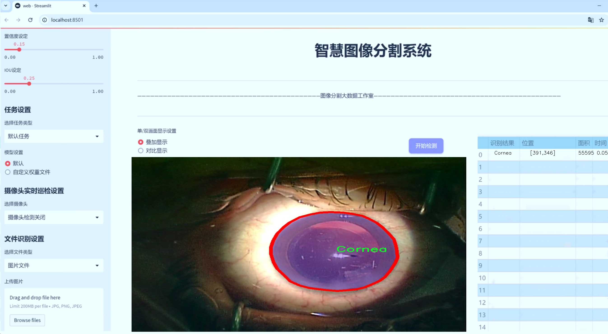
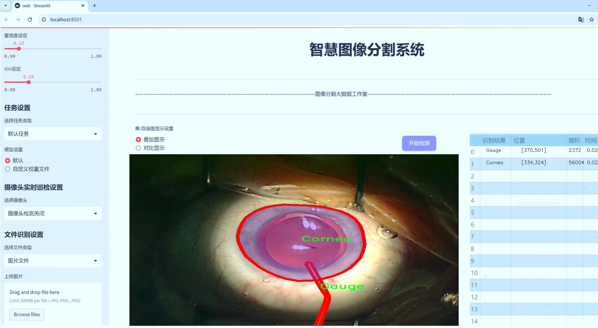
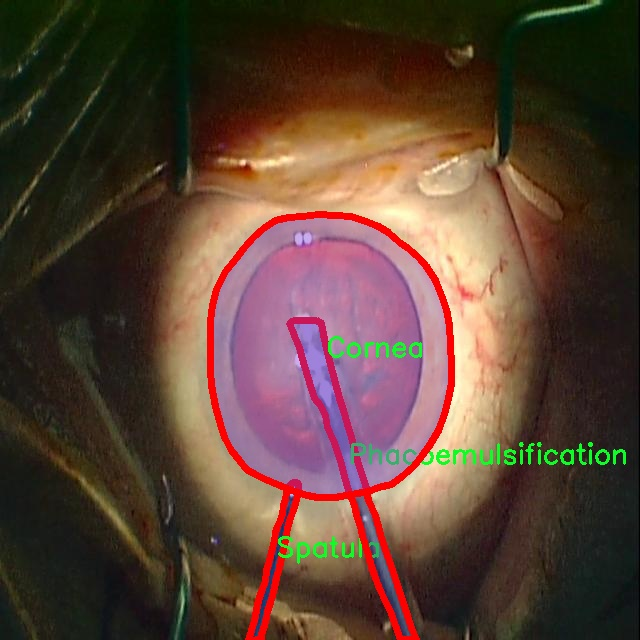
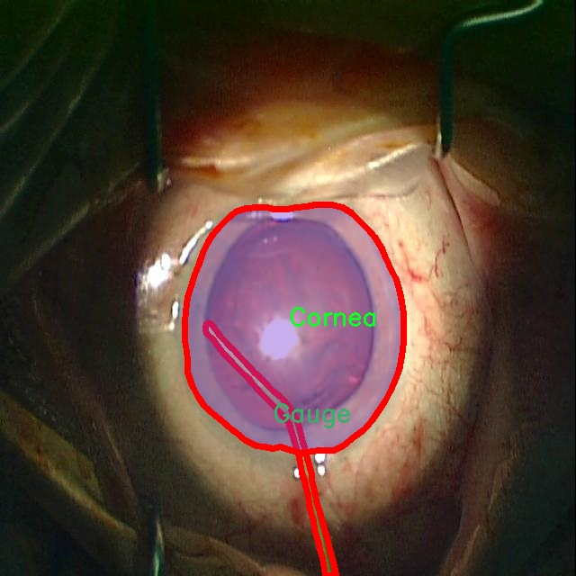
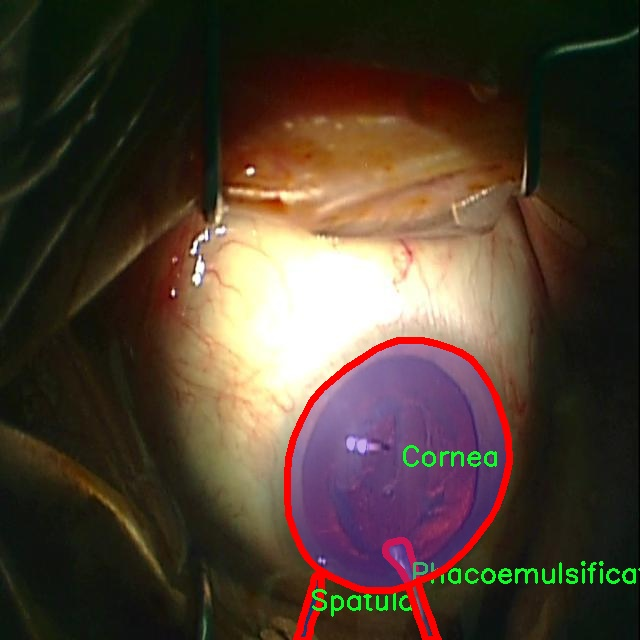
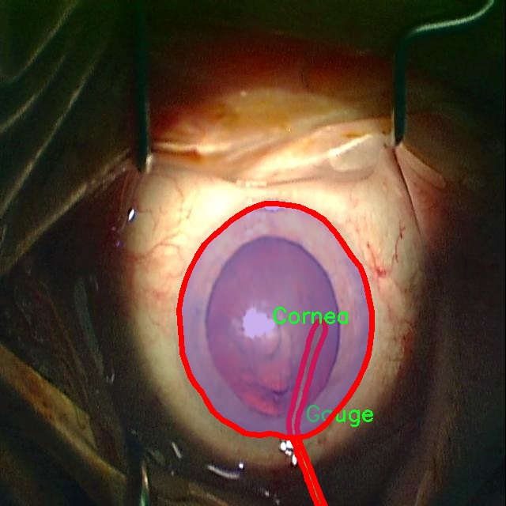
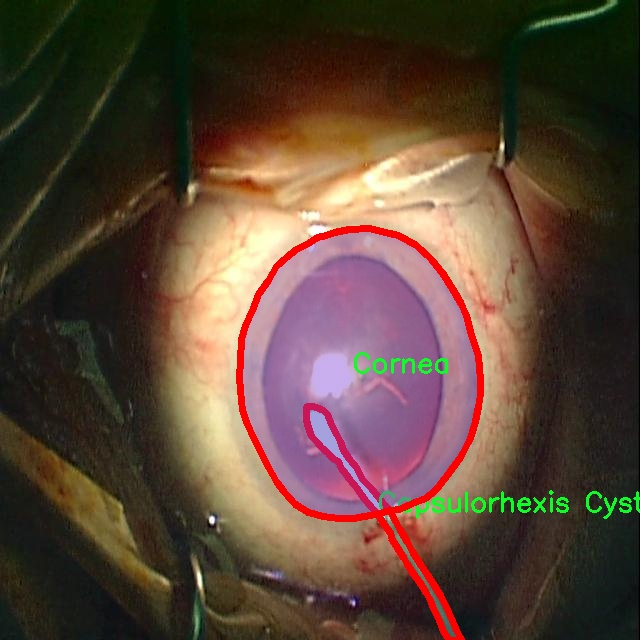

# 白内障手术器械分割系统源码＆数据集分享
 [yolov8-seg-C2f-DCNV2-Dynamic＆yolov8-seg-EfficientRepBiPAN等50+全套改进创新点发刊_一键训练教程_Web前端展示]

### 1.研究背景与意义

项目参考[ILSVRC ImageNet Large Scale Visual Recognition Challenge](https://gitee.com/YOLOv8_YOLOv11_Segmentation_Studio/projects)

项目来源[AAAI Global Al lnnovation Contest](https://kdocs.cn/l/cszuIiCKVNis)

研究背景与意义

白内障手术是全球范围内最常见的眼科手术之一，随着人口老龄化的加剧，白内障的发病率逐年上升，手术需求也随之增加。根据世界卫生组织的统计，白内障是导致全球可逆性失明的主要原因之一。因此，提升白内障手术的安全性和有效性显得尤为重要。在这一背景下，手术器械的精准识别与分割成为了提高手术效率和安全性的关键因素。传统的手术器械识别方法往往依赖于人工操作，不仅耗时耗力，而且容易受到人为因素的影响，导致识别精度不足。基于深度学习的图像分割技术，尤其是YOLO（You Only Look Once）系列模型的迅速发展，为解决这一问题提供了新的思路。

YOLOv8作为YOLO系列的最新版本，具备了更高的检测精度和更快的处理速度，能够在复杂的手术环境中实时识别和分割多种手术器械。通过对YOLOv8模型的改进，可以进一步提升其在白内障手术器械分割中的应用效果。本研究旨在基于改进的YOLOv8模型，构建一个高效的白内障手术器械分割系统，以实现对手术过程中使用的12种不同器械的精准识别与分割。这些器械包括但不限于囊膜切开针、囊膜钳、角膜、刻度尺、切口刀、灌注吸引器、Katena钳、晶状体注射器、超声乳化尖端、裂隙刀和刮刀等。

为实现这一目标，本研究将使用“Cataract_1K_2”数据集，该数据集包含2300幅高质量的手术图像，涵盖了12类手术器械。数据集的丰富性和多样性为模型的训练和验证提供了坚实的基础。通过对数据集的深入分析与处理，能够有效提高模型的泛化能力，确保其在实际手术场景中的应用效果。此外，数据集中的每一类器械均具有独特的形态特征，利用改进的YOLOv8模型进行实例分割，可以实现对这些器械的精准定位与轮廓提取，从而为手术机器人或辅助系统提供实时反馈，帮助外科医生在手术过程中做出更为精准的决策。

本研究的意义不仅在于推动白内障手术器械识别技术的发展，更在于为智能医疗的实现提供了新的思路和方法。通过将深度学习技术与医疗影像分析相结合，能够有效提升手术的自动化水平，减少医生的工作负担，提高手术的安全性和成功率。同时，该系统的成功应用也为其他类型的手术器械识别提供了借鉴，具有广泛的推广价值。综上所述，基于改进YOLOv8的白内障手术器械分割系统的研究，不仅具有重要的学术价值，更具备深远的社会意义。

### 2.图片演示







##### 注意：由于此博客编辑较早，上面“2.图片演示”和“3.视频演示”展示的系统图片或者视频可能为老版本，新版本在老版本的基础上升级如下：（实际效果以升级的新版本为准）

  （1）适配了YOLOV8的“目标检测”模型和“实例分割”模型，通过加载相应的权重（.pt）文件即可自适应加载模型。

  （2）支持“图片识别”、“视频识别”、“摄像头实时识别”三种识别模式。

  （3）支持“图片识别”、“视频识别”、“摄像头实时识别”三种识别结果保存导出，解决手动导出（容易卡顿出现爆内存）存在的问题，识别完自动保存结果并导出到tempDir中。

  （4）支持Web前端系统中的标题、背景图等自定义修改，后面提供修改教程。

  另外本项目提供训练的数据集和训练教程,暂不提供权重文件（best.pt）,需要您按照教程进行训练后实现图片演示和Web前端界面演示的效果。

### 3.视频演示

[3.1 视频演示](https://www.bilibili.com/video/BV1cayTY3ER7/)

### 4.数据集信息展示

##### 4.1 本项目数据集详细数据（类别数＆类别名）

nc: 12
names: ['Capsulorhexis Cystotome', 'Capsulorhexis Forceps', 'Cornea', 'Gauge', 'Incision Knife', 'Irrigation-Aspiration', 'Katena Forceps', 'Lens Injector', 'Phacoemulsification Tip', 'Slit Knife', 'Spatula', 'cornea1']


##### 4.2 本项目数据集信息介绍

数据集信息展示

在本研究中，我们使用了名为“Cataract_1K_2”的数据集，旨在训练和改进YOLOv8-seg模型，以实现对白内障手术器械的精准分割。该数据集包含12个类别，涵盖了白内障手术中常用的器械和组织，提供了丰富的标注信息，能够有效支持模型的训练和评估。

首先，数据集中的类别包括“Capsulorhexis Cystotome”、“Capsulorhexis Forceps”、“Cornea”、“Gauge”、“Incision Knife”、“Irrigation-Aspiration”、“Katena Forceps”、“Lens Injector”、“Phacoemulsification Tip”、“Slit Knife”、“Spatula”以及“cornea1”。这些类别不仅代表了手术过程中使用的各种器械，还包括了手术中涉及的生物组织，尤其是角膜（Cornea）的不同状态。这种多样性使得数据集能够覆盖白内障手术的多个方面，为模型的学习提供了全面的视角。

在数据集的构建过程中，确保了图像的多样性和标注的准确性。每个类别的样本数量均衡，避免了模型在训练过程中出现偏向某一类别的现象。此外，数据集中的图像来源于真实的手术场景，涵盖了不同的手术角度、光照条件和背景环境。这种多样性不仅增强了模型的鲁棒性，也提高了其在实际应用中的适应能力。

在数据预处理阶段，我们对图像进行了标准化处理，以确保输入数据的一致性。每张图像都经过了尺寸调整和归一化，以适应YOLOv8-seg模型的输入要求。同时，针对不同类别的器械和组织，我们采用了精细的标注策略，确保每个对象的边界框和分割掩码的准确性。这一过程不仅提高了数据集的质量，也为后续的模型训练奠定了坚实的基础。

为了进一步提升模型的性能，我们还采用了数据增强技术，包括随机旋转、翻转、缩放和颜色调整等。这些技术不仅增加了训练样本的多样性，还有效地减少了模型对特定图像特征的依赖，从而提高了其泛化能力。通过这种方式，我们期望模型能够在面对未见过的手术图像时，依然能够保持良好的分割效果。

在模型训练过程中，我们将“Cataract_1K_2”数据集分为训练集、验证集和测试集，以便于对模型的性能进行全面评估。训练集用于模型的学习，验证集用于调优超参数，而测试集则用于最终的性能评估。通过这种系统化的划分，我们能够更准确地评估模型在实际应用中的表现。

总之，“Cataract_1K_2”数据集为我们改进YOLOv8-seg的白内障手术器械分割系统提供了坚实的基础。通过丰富的类别、多样的样本和精细的标注，该数据集不仅为模型的训练提供了必要的数据支持，也为后续的研究和应用奠定了良好的基础。我们期待通过这一研究，能够推动白内障手术的自动化和智能化进程，提高手术的安全性和效率。











### 5.全套项目环境部署视频教程（零基础手把手教学）

[5.1 环境部署教程链接（零基础手把手教学）](https://www.bilibili.com/video/BV1jG4Ve4E9t/?vd_source=bc9aec86d164b67a7004b996143742dc)


[5.2 安装Python虚拟环境创建和依赖库安装视频教程链接（零基础手把手教学）](https://www.bilibili.com/video/BV1nA4VeYEze/?vd_source=bc9aec86d164b67a7004b996143742dc)

### 6.手把手YOLOV8-seg训练视频教程（零基础小白有手就能学会）

[6.1 手把手YOLOV8-seg训练视频教程（零基础小白有手就能学会）](https://www.bilibili.com/video/BV1cA4VeYETe/?vd_source=bc9aec86d164b67a7004b996143742dc)


按照上面的训练视频教程链接加载项目提供的数据集，运行train.py即可开始训练



     Epoch   gpu_mem       box       obj       cls    labels  img_size
     1/200     0G   0.01576   0.01955  0.007536        22      1280: 100%|██████████| 849/849 [14:42<00:00,  1.04s/it]
               Class     Images     Labels          P          R     mAP@.5 mAP@.5:.95: 100%|██████████| 213/213 [01:14<00:00,  2.87it/s]
                 all       3395      17314      0.994      0.957      0.0957      0.0843

     Epoch   gpu_mem       box       obj       cls    labels  img_size
     2/200     0G   0.01578   0.01923  0.007006        22      1280: 100%|██████████| 849/849 [14:44<00:00,  1.04s/it]
               Class     Images     Labels          P          R     mAP@.5 mAP@.5:.95: 100%|██████████| 213/213 [01:12<00:00,  2.95it/s]
                 all       3395      17314      0.996      0.956      0.0957      0.0845

     Epoch   gpu_mem       box       obj       cls    labels  img_size
     3/200     0G   0.01561    0.0191  0.006895        27      1280: 100%|██████████| 849/849 [10:56<00:00,  1.29it/s]
               Class     Images     Labels          P          R     mAP@.5 mAP@.5:.95: 100%|███████   | 187/213 [00:52<00:00,  4.04it/s]
                 all       3395      17314      0.996      0.957      0.0957      0.0845


### 7.50+种全套YOLOV8-seg创新点代码加载调参视频教程（一键加载写好的改进模型的配置文件）

[7.1 50+种全套YOLOV8-seg创新点代码加载调参视频教程（一键加载写好的改进模型的配置文件）](https://www.bilibili.com/video/BV1Hw4VePEXv/?vd_source=bc9aec86d164b67a7004b996143742dc)

### 8.YOLOV8-seg图像分割算法原理

原始YOLOv8-seg算法原理

YOLOv8-seg算法是YOLO系列的最新进展，结合了目标检测与图像分割的任务，旨在实现更高效、更精确的图像理解。作为YOLO系列的一部分，YOLOv8-seg在前期的YOLOv3、YOLOv5等算法的基础上，进行了多方面的创新与改进，尤其是在数据处理、网络结构、损失函数以及标签分配策略等方面，充分体现了深度学习领域的最新研究成果。

首先，YOLOv8-seg在数据预处理方面延续了YOLOv5的成功经验，采用了多种数据增强技术来提升模型的泛化能力。这些技术包括马赛克增强、混合增强、空间扰动和颜色扰动等。马赛克增强通过将多张图像拼接在一起，生成新的训练样本，能够有效提高模型对不同场景的适应性；混合增强则通过将两张图像进行加权融合，增加了样本的多样性；空间扰动和颜色扰动则进一步丰富了图像的表现形式，使得模型在训练过程中能够接触到更多的变换情况，从而提升其鲁棒性。

在网络结构方面，YOLOv8-seg引入了新的C2f模块，替代了YOLOv5中的C3模块。C2f模块通过增加更多的分支，增强了梯度回传的能力，使得特征提取过程更加高效。该模块的设计灵感来源于YOLOv7中的ELAN模块，旨在在保持轻量化的同时，获得更丰富的梯度信息。这种结构的变化，使得YOLOv8-seg在处理复杂场景时，能够更好地捕捉到细微的特征变化，进而提升分割的精度。

YOLOv8-seg仍然采用了FPN-PAN结构，以实现多尺度特征的融合。FPN（特征金字塔网络）和PAN（路径聚合网络）的结合，使得模型能够在不同尺度上进行信息的整合，充分利用低层特征的细节和高层特征的语义信息。这种结构的优势在于，它能够有效地提升目标检测和分割的性能，尤其是在处理小目标和复杂背景时，表现得尤为突出。

在检测头的设计上，YOLOv8-seg采用了解耦合头结构，将分类和定位任务分开处理。这种解耦合的方式使得模型在进行分类和定位时，可以更专注于各自的任务，从而提高了整体的检测精度。此外，YOLOv8-seg还引入了Anchor-Free的设计理念，减少了对先验框的依赖，使得模型在处理不同形状和尺寸的目标时，能够更加灵活。

标签分配策略是YOLOv8-seg的另一个重要创新点。与YOLOv5的候选框聚类策略不同，YOLOv8-seg采用了动态标签分配策略，称为TOOD（Task-Oriented Object Detection）。这种策略通过动态调整正负样本的匹配，解决了多尺度分配的问题，使得模型在训练过程中能够更有效地学习到目标的特征。这种灵活的标签分配方式，不仅提高了训练效率，还显著提升了模型在实际应用中的表现。

在损失函数的设计上，YOLOv8-seg引入了Varifocal Loss（VFL）作为分类损失，结合CIoU Loss和DFL Loss作为回归损失。VFL通过对正负样本进行不对称加权，使得模型在训练时更加关注高质量的正样本，从而提高了分类的准确性。CIoU Loss则通过考虑目标框的中心点、宽高比和重叠度，提供了更为全面的回归损失评估，进一步提升了模型的定位精度。

综上所述，YOLOv8-seg算法通过在数据预处理、网络结构、检测头设计、标签分配策略和损失函数等多个方面的创新，展现了其在目标检测与图像分割任务中的强大能力。该算法不仅在精度上有所提升，还在处理速度和模型效率上表现出色，适用于各种实际应用场景，如自动驾驶、安防监控、医学影像分析等。随着YOLOv8-seg的不断发展与完善，未来有望在更广泛的领域中发挥重要作用，推动计算机视觉技术的进一步进步。


### 9.系统功能展示（检测对象为举例，实际内容以本项目数据集为准）

图9.1.系统支持检测结果表格显示

  图9.2.系统支持置信度和IOU阈值手动调节

  图9.3.系统支持自定义加载权重文件best.pt(需要你通过步骤5中训练获得)

  图9.4.系统支持摄像头实时识别

  图9.5.系统支持图片识别

  图9.6.系统支持视频识别

  图9.7.系统支持识别结果文件自动保存

  图9.8.系统支持Excel导出检测结果数据


### 10.50+种全套YOLOV8-seg创新点原理讲解（非科班也可以轻松写刊发刊，V11版本正在科研待更新）

#### 10.1 由于篇幅限制，每个创新点的具体原理讲解就不一一展开，具体见下列网址中的创新点对应子项目的技术原理博客网址【Blog】：


[10.1 50+种全套YOLOV8-seg创新点原理讲解链接](https://gitee.com/qunmasj/good)

#### 10.2 部分改进模块原理讲解(完整的改进原理见上图和技术博客链接)【如果此小节的图加载失败可以通过CSDN或者Github搜索该博客的标题访问原始博客，原始博客图片显示正常】

### YOLOv8简介
继YOLOv5之后,Ultralytics公司在2023年1月发布了YOLOv8,该版本可以用于执行目标检测、实例分割和图像分类任务。整个网络结构由4部分组成:输入图像, Backbone主干网络获得图像的特征图, Head检测头预测目标对象和位置, Neck融合不同层的特征并将图像特征传递到预测层。
1)相比于YOLOv5和 YOLOv7算法,YOLOv8在训练时间和检测精度上得到极大提升,而且模型的权重文件只有6 MB,可以部署到任一嵌入式设备中,它凭借自身快速、高效的性能可以很好地满足实时检测的需求。
2)由于YOLOv8算法是YOLOv5的继承版本，对应提供了N、S、 M、L、X 等不同尺度的模型,用于满足不同场景的需求,在精度得到大幅提升的同时,能流畅地训练,并且能安装在各种硬件平台上运行。
3)在输入端,YOLOv8算法使用了Mosaic数据增强[15]、自适应锚框计算[16]等方法。Mosaic数据增强是通过随机缩放、随机裁剪、随机排布的方式进行拼接,丰富检测数据集。自适应锚框计算是网络在初始锚框的基础上输出预测框,通过差值计算、反向更新等操作计算出最佳锚框值。
4)在输出端,YOLOv8算法使用解耦头替换了以往的耦合头,将分类和回归解耦为两个独立的分支,通过解耦使各个任务更加专注,从而解决复杂场景下定位不准及分类错误的问题。


### OREPA：在线卷积重参数化
卷积神经网络(CNNs)已经在许多计算机视觉任务的应用成功，包括图像分类、目标检测、语义分割等。精度和模型效率之间的权衡也已被广泛讨论。

一般来说，一个精度较高的模型通常需要一个更复杂的块，一个更宽或更深的结构。然而，这样的模型总是太重，无法部署，特别是在硬件性能有限、需要实时推理的场景下。考虑到效率，更小、更紧凑和更快的模型自然是首选。

为了获得一个部署友好且高精度的模型，有研究者提出了基于结构重参数化的方法来释放性能。在这些方法中，模型在训练阶段和推理阶段有不同的结构。具体来说，使用复杂的训练阶段拓扑，即重参数化的块，来提高性能。训练结束后，通过等效变换将一个复杂的块重参为成一个单一的线性层。重参后的模型通常具有一个整洁架构模型，例如，通常是一个类似VGG的或一个类似ResNet的结构。从这个角度来看，重参化策略可以在不引入额外的推理时间成本的情况下提高模型的性能。


BN层是重构模型的关键组成部分。在一个重新解析块(图1(b))中，在每个卷积层之后立即添加一个BN层。可以观察到，去除这些BN层会导致的性能退化。然而，当考虑到效率时，这种BN层的使用出乎意料地在训练阶段带来了巨大的计算开销。在推理阶段，复杂的块可以被压缩成一个卷积层。但是，在训练过程中，BN层是非线性的，也就是说，它们将特征映射除以它的标准差，这就阻止了合并整个块。因此，存在大量的中间计算操作(large FLOPS)和缓冲特征映射(high memory usage)。更糟糕的是，这么高的训练预算使得很难探索更复杂和可能更强的重参块。很自然地，下面的问题就出现了：

为什么标准化在重参中这么重要？

通过分析和实验，作者认为BN层中的尺度因子最重要，因为它们能够使不同分支的优化方向多样化。

基于观察结果，作者提出了在线重参化(OREPA)(图1(c))，这是一个两阶段的pipeline，使之能够简化复杂的training-time re-param block。

在第一阶段，block linearization，去除所有的非线性BN层，并引入线性缩放层。这些层与BN层具有相似的性质，因此它们使不同分支的优化多样化。此外，这些层都是线性的，可以在训练过程中合并成卷积层。

第二阶段，block squeezing，将复杂的线性块简化为单一的卷积层。OREPA通过减少由中间计算层引起的计算和存储开销，显著降低了训练成本，对性能只有非常小的影响。

此外，高效化使得探索更复杂的重参化拓扑成为可能。为了验证这一点，作者进一步提出了几个重参化的组件，以获得更好的性能。

在ImageNet分类任务上评估了所提出的OREPA。与最先进的修复模型相比，OREPA将额外的训练时间GPU内存成本降低了65%到75%，并将训练过程加快了1.5-2.3倍。同时，OREPA-ResNet和OREPA-VGG的性能始终优于+0.2%∼+0.6%之前的DBB和RepVGG方法。同时作者还评估了在下游任务上的OREPA，即目标检测和语义分割。作者发现OREPA可以在这些任务上也可以带来性能的提高。

提出了在线卷积重参化(OREPA)策略，这极大地提高了重参化模型的训练效率，并使探索更强的重参化块成为可能；

通过对重参化模型工作机制的分析，用引入的线性尺度层代替BN层，这仍然提供了不同的优化方向，并保持了表示能力;

在各种视觉任务上的实验表明，OREPA在准确性和训练效率方面都优于以前的重参化模型(DBB/RepVGG)。


#### 结构重参化
结构重参化最近被重视并应用于许多计算机视觉任务，如紧凑模型设计、架构搜索和剪枝。重参化意味着不同的架构可以通过参数的等价转换来相互转换。例如，1×1卷积的一个分支和3×3卷积的一个分支，可以转移到3×3卷积的单个分支中。在训练阶段，设计了多分支和多层拓扑来取代普通的线性层(如conv或全连接层)来增强模型。Cao等讨论了如何在训练过程中合并深度可分离卷积核。然后在推理过程中，将训练时间的复杂模型转移到简单模型中，以便于更快的推理。

在受益于复杂的training-time拓扑，同时，当前的重参化方法训练使用不可忽略的额外计算成本。当块变得更复杂以变得更强的表示时，GPU内存利用率和训练时间将会越来越长，最终走向不可接受。与以往的重参化方法不同，本文更多地关注训练成本。提出了一种通用的在线卷积重参化策略，使training-time的结构重参化成为可能。


#### Normalization
BN被提出来缓解训练非常深度神经网络时的梯度消失问题。人们认为BN层是非常重要的，因为它们平滑了损失。最近关于无BN神经网络的研究声称，BN层并不是不可或缺的。通过良好的初始化和适当的正则化，可以优雅地去除BN层。

对于重参化模型，作者认为重参化块中的BN层是关键的。无BN的变体将会出现性能下降。然而，BN层是非线性的，也就是说，它们将特征图除以它的标准差，这阻止了在线合并块。为了使在线重参化可行，作者去掉了重参块中的所有BN层，并引入了BN层的线性替代方法，即线性缩放层。

#### 卷积分解
标准卷积层计算比较密集，导致大的FLOPs和参数量。因此，卷积分解方法被提出，并广泛应用于移动设备的轻量化模型中。重参化方法也可以看作是卷积分解的某种形式，但它更倾向于更复杂的拓扑结构。本文的方法的不同之处在于，在kernel-level上分解卷积，而不是在structure level。

#### 在线重参化
在本节中，首先，分析了关键组件，即重参化模型中的BN层，在此基础上提出了在线重参化(OREPA)，旨在大大减少再参数化模型的训练时间预算。OREPA能够将复杂的训练时间块简化为一个卷积层，并保持了较高的精度。

OREPA的整体pipeline如图所示，它包括一个Block Linearization阶段和一个Block Squeezing阶段。


参考该博客通过分析多层和多分支结构的优化多样性，深入研究了重参化的有效性，并证明了所提出的线性缩放层和BN层具有相似的效果。

最后，随着训练预算的减少，进一步探索了更多的组件，以实现更强的重参化模型，成本略有增加。

#### 重参化中的Normalization
作者认为中间BN层是重参化过程中多层和多分支结构的关键组成部分。以SoTA模型DBB和RepVGG为例，去除这些层会导致严重的性能下降，如表1所示。


这种观察结果也得到了Ding等人的实验支持。因此，作者认为中间的BN层对于重参化模型的性能是必不可少的。

然而，中间BN层的使用带来了更高的训练预算。作者注意到，在推理阶段，重参化块中的所有中间操作都是线性的，因此可以合并成一个卷积层，从而形成一个简单的结构。

但在训练过程中，BN层是非线性的，即它们将特征映射除以其标准差。因此，中间操作应该单独计算，这将导致更高的计算和内存成本。更糟糕的是，如此高的成本将阻止探索更强大的训练模块。

#### Block Linearization
如3.1中所述，中间的BN层阻止了在训练过程中合并单独的层。然而，由于性能问题，直接删除它们并不简单。为了解决这一困境，作者引入了channel级线性尺度操作作为BN的线性替代方法。

缩放层包含一个可学习的向量，它在通道维度中缩放特征映射。线性缩放层具有与BN层相似的效果，它们都促进多分支向不同的方向进行优化，这是重参化时性能提高的关键。除了对性能的影响外，线性缩放层还可以在训练过程中进行合并，使在线重参化成为可能。


基于线性缩放层，作者修改了重参化块，如图所示。具体来说，块的线性化阶段由以下3个步骤组成：

首先，删除了所有的非线性层，即重参化块中的BN层

其次，为了保持优化的多样性，在每个分支的末尾添加了一个缩放层，这是BN的线性替代方法

最后，为了稳定训练过程，在所有分支的添加后添加一个BN层。

一旦完成线性化阶段，在重参化块中只存在线性层，这意味着可以在训练阶段合并块中的所有组件。

#### Block Squeezing
Block Squeezing步骤将计算和内存昂贵的中间特征映射上的操作转换为更经济的kernel上的操作。这意味着在计算和内存方面从减少到，其中、是特征图和卷积核的空间尺寸。

一般来说，无论线性重参化块是多么复杂，以下2个属性始终成立：

Block中的所有线性层，例如深度卷积、平均池化和所提出的线性缩放，都可以用带有相应参数的退化卷积层来表示;

Block可以由一系列并行分支表示，每个分支由一系列卷积层组成。

有了上述两个特性，如果可以将

多层（即顺序结构）

多分支（即并行结构）

简化为单一卷积，就可以压缩一个块。在下面的部分中，将展示如何简化顺序结构(图(a))和并行结构(图(b))。


### 11.项目核心源码讲解（再也不用担心看不懂代码逻辑）

#### 11.1 ultralytics\engine\exporter.py

以下是对代码的核心部分进行的提炼和详细中文注释：

```python
import json
import os
import shutil
import subprocess
import time
import warnings
from copy import deepcopy
from datetime import datetime
from pathlib import Path

import numpy as np
import torch

from ultralytics.cfg import get_cfg
from ultralytics.utils import (LOGGER, __version__, get_default_args, yaml_save)
from ultralytics.utils.checks import check_imgsz, check_requirements, check_version
from ultralytics.utils.torch_utils import select_device

class Exporter:
    """
    导出模型的类。

    属性:
        args (SimpleNamespace): 导出器的配置。
        callbacks (list, optional): 回调函数列表。默认为 None。
    """

    def __init__(self, cfg=DEFAULT_CFG, overrides=None, _callbacks=None):
        """
        初始化 Exporter 类。

        参数:
            cfg (str, optional): 配置文件的路径。默认为 DEFAULT_CFG。
            overrides (dict, optional): 配置覆盖。默认为 None。
            _callbacks (dict, optional): 回调函数字典。默认为 None。
        """
        self.args = get_cfg(cfg, overrides)  # 获取配置
        self.callbacks = _callbacks or callbacks.get_default_callbacks()  # 设置回调函数

    def __call__(self, model=None):
        """在运行回调后返回导出文件/目录的列表。"""
        self.run_callbacks('on_export_start')  # 开始导出回调
        t = time.time()  # 记录开始时间

        fmt = self.args.format.lower()  # 将格式转换为小写
        self.device = select_device('cpu' if self.args.device is None else self.args.device)  # 选择设备

        # 检查模型类名
        model.names = check_class_names(model.names)

        # 检查输入图像大小
        self.imgsz = check_imgsz(self.args.imgsz, stride=model.stride, min_dim=2)

        # 创建输入张量
        im = torch.zeros(self.args.batch, 3, *self.imgsz).to(self.device)

        # 更新模型
        model = deepcopy(model).to(self.device)  # 深拷贝模型并移动到指定设备
        model.eval()  # 设置模型为评估模式
        model.float()  # 转换为浮点数

        # 执行干运行以检查模型
        y = model(im)  # 进行一次前向传播

        # 记录导出信息
        LOGGER.info(f"开始导出，输入形状: {tuple(im.shape)} 输出形状: {tuple(y.shape)}")

        # 导出不同格式的模型
        f = [''] * len(export_formats()['Argument'][1:])  # 初始化导出文件名列表
        if self.args.format == 'onnx':
            f[0], _ = self.export_onnx()  # 导出为 ONNX 格式

        # 完成导出
        f = [str(x) for x in f if x]  # 过滤空值
        LOGGER.info(f'导出完成，结果保存到: {f}')
        self.run_callbacks('on_export_end')  # 结束导出回调
        return f  # 返回导出文件列表

    def export_onnx(self, prefix='ONNX:'):
        """导出为 ONNX 格式的模型。"""
        import onnx  # 导入 ONNX 库

        # 获取 ONNX 导出文件名
        f = str(self.file.with_suffix('.onnx'))

        # 导出模型
        torch.onnx.export(
            self.model.cpu(),  # 将模型移动到 CPU
            self.im.cpu(),  # 将输入张量移动到 CPU
            f,
            input_names=['images'],  # 输入名称
            output_names=['output0'],  # 输出名称
            dynamic_axes={'images': {0: 'batch', 2: 'height', 3: 'width'}}  # 动态轴
        )

        # 返回导出的文件名
        return f, None
```

### 代码分析与注释说明：
1. **类 `Exporter`**: 该类负责将 YOLOv8 模型导出为不同格式。初始化时，它会读取配置并设置回调函数。

2. **`__call__` 方法**: 该方法是导出模型的主要逻辑。它会选择设备（CPU或GPU），检查模型的类名和输入图像大小，并进行一次前向传播以确保模型正常工作。最后，它会调用相应的导出方法并返回导出的文件列表。

3. **`export_onnx` 方法**: 该方法负责将模型导出为 ONNX 格式。它使用 PyTorch 的 `torch.onnx.export` 函数来完成导出，并设置输入和输出的名称及动态轴。

4. **日志记录**: 在导出过程中，使用 `LOGGER` 记录导出状态和结果，方便调试和跟踪。

5. **异常处理**: 在导出过程中，代码会处理可能出现的异常，确保在导出失败时能够记录错误信息。

以上是对代码的核心部分进行了提炼和详细注释，帮助理解其功能和实现逻辑。

这个文件是Ultralytics YOLOv8模型的导出模块，主要用于将训练好的YOLOv8 PyTorch模型导出为多种格式，以便在不同的环境和平台上使用。文件中包含了多种导出格式的支持，包括PyTorch、TorchScript、ONNX、OpenVINO、TensorRT、CoreML、TensorFlow SavedModel、TensorFlow Lite、TensorFlow Edge TPU、TensorFlow.js、PaddlePaddle和ncnn等。

文件开头提供了支持的导出格式的列表以及对应的命令行参数，用户可以通过Python代码或命令行接口（CLI）来调用导出功能。导出功能的实现依赖于一些外部库，如TensorFlow、ONNX、CoreML等，因此在使用之前需要确保这些库已安装。

文件中定义了一个`Exporter`类，该类负责处理模型的导出过程。构造函数中接收配置文件路径和覆盖参数，并根据这些参数初始化导出器的设置。导出过程通过`__call__`方法触发，该方法会根据用户指定的格式进行相应的检查和准备工作，包括模型的输入形状、设备选择、模型参数的冻结等。

在导出过程中，文件使用了装饰器`@try_export`来捕获导出过程中的异常，并记录成功或失败的信息。每种导出格式都有对应的导出方法，例如`export_torchscript`、`export_onnx`、`export_openvino`等。这些方法中实现了具体的导出逻辑，包括模型的转换、保存文件、元数据的添加等。

此外，文件中还定义了一些辅助函数，例如`gd_outputs`用于获取TensorFlow GraphDef模型的输出节点名称，`export_formats`用于返回支持的导出格式的详细信息。文件中还使用了日志记录功能，以便在导出过程中提供实时反馈。

在导出完成后，用户可以通过命令行或Python代码进行模型推理，支持的推理格式与导出格式相对应，确保用户可以在导出后直接使用模型进行推理。

总的来说，这个文件是YOLOv8模型导出功能的核心实现，提供了灵活的导出选项和良好的用户体验，使得用户能够方便地将模型应用于不同的场景和平台。

#### 11.2 web.py

以下是经过简化并注释的核心代码部分，保留了图像处理和检测的主要功能：

```python
import cv2
import numpy as np
from PIL import ImageFont, ImageDraw, Image
from hashlib import md5

def calculate_polygon_area(points):
    """
    计算多边形的面积，输入应为一个 Nx2 的numpy数组，表示多边形的顶点坐标
    """
    if len(points) < 3:  # 多边形至少需要3个顶点
        return 0
    return cv2.contourArea(points)

def draw_with_chinese(image, text, position, font_size=20, color=(255, 0, 0)):
    """
    在OpenCV图像上绘制中文文字
    """
    # 将图像从 OpenCV 格式（BGR）转换为 PIL 格式（RGB）
    image_pil = Image.fromarray(cv2.cvtColor(image, cv2.COLOR_BGR2RGB))
    draw = ImageDraw.Draw(image_pil)
    # 使用指定的字体
    font = ImageFont.truetype("simsun.ttc", font_size, encoding="unic")
    draw.text(position, text, font=font, fill=color)
    # 将图像从 PIL 格式（RGB）转换回 OpenCV 格式（BGR）
    return cv2.cvtColor(np.array(image_pil), cv2.COLOR_RGB2BGR)

def generate_color_based_on_name(name):
    """
    使用哈希函数生成稳定的颜色
    """
    hash_object = md5(name.encode())
    hex_color = hash_object.hexdigest()[:6]  # 取前6位16进制数
    r, g, b = int(hex_color[0:2], 16), int(hex_color[2:4], 16), int(hex_color[4:6], 16)
    return (b, g, r)  # OpenCV 使用BGR格式

def draw_detections(image, info, alpha=0.2):
    """
    在图像上绘制检测结果，包括边界框和类别名称
    """
    name, bbox = info['class_name'], info['bbox']
    x1, y1, x2, y2 = bbox
    # 绘制边界框
    cv2.rectangle(image, (x1, y1), (x2, y2), color=(0, 0, 255), thickness=3)
    # 绘制类别名称
    image = draw_with_chinese(image, name, (x1, y1 - 10), font_size=20)
    return image

def frame_process(image, model, conf_threshold=0.15):
    """
    处理并预测单个图像帧的内容
    """
    pre_img = model.preprocess(image)  # 对图像进行预处理
    pred = model.predict(pre_img)  # 使用模型进行预测

    detInfo = []  # 初始化检测信息列表

    # 如果有有效的检测结果
    if pred is not None and len(pred):
        for info in pred:  # 遍历检测到的对象
            image = draw_detections(image, info)  # 绘制检测结果
            detInfo.append(info)  # 添加检测信息

    return image, detInfo  # 返回处理后的图像和检测信息

# 示例用法
if __name__ == "__main__":
    # 假设有一个模型实例和输入图像
    model = ...  # 加载或初始化模型
    image = cv2.imread("input_image.jpg")  # 读取输入图像

    processed_image, detections = frame_process(image, model)  # 处理图像
    cv2.imshow("Detected Image", processed_image)  # 显示处理后的图像
    cv2.waitKey(0)
    cv2.destroyAllWindows()
```

### 代码说明：
1. **calculate_polygon_area**: 计算多边形的面积，输入为多边形的顶点坐标。
2. **draw_with_chinese**: 在图像上绘制中文文本，使用PIL库处理字体。
3. **generate_color_based_on_name**: 根据名称生成唯一的颜色，使用MD5哈希。
4. **draw_detections**: 在图像上绘制检测结果，包括边界框和类别名称。
5. **frame_process**: 处理输入图像，进行模型预测并绘制检测结果。

该代码的核心功能是图像处理和目标检测，适用于计算机视觉任务。

这个程序文件 `web.py` 是一个基于 Streamlit 的图像分割和目标检测系统，主要用于实时处理摄像头输入或上传的图像和视频文件。程序的核心功能包括目标检测、结果展示和日志记录。

首先，程序导入了必要的库，包括用于图像处理的 OpenCV、用于数值计算的 NumPy、用于创建 Web 应用的 Streamlit，以及一些自定义的模块和工具函数。这些库为图像处理、用户界面构建和数据记录提供了支持。

程序定义了一些辅助函数，例如计算多边形面积、在图像上绘制中文文本、生成基于名称的颜色、调整参数等。这些函数在后续的图像处理和结果展示中起到了重要作用。

接下来，定义了一个 `Detection_UI` 类，负责整个检测系统的初始化和运行。该类的构造函数中，初始化了一些参数和变量，包括类别标签、颜色、模型配置、摄像头选择、文件上传等。通过调用 `setup_page` 和 `setup_sidebar` 方法，设置了页面的布局和侧边栏的选项，允许用户选择模型类型、置信度阈值、IOU 阈值以及上传文件。

`process_camera_or_file` 方法是程序的核心逻辑之一，负责处理用户选择的输入源（摄像头或文件）。如果选择了摄像头，程序会使用 OpenCV 捕获视频流，并在每一帧上进行目标检测。检测结果会被绘制在图像上，并保存到日志中。如果选择了上传的文件，程序会读取文件并进行相应的处理。

在图像处理过程中，`frame_process` 方法会对每一帧进行预处理、模型预测和后处理，最终返回处理后的图像和检测信息。检测结果会被绘制在图像上，并在用户界面中以表格形式展示。

此外，程序还提供了导出结果的功能，用户可以将检测结果保存为 CSV 文件。通过使用 Streamlit 的交互式组件，用户可以方便地控制检测过程，包括开始检测、选择摄像头、上传文件等。

最后，程序通过实例化 `Detection_UI` 类并调用 `setupMainWindow` 方法来启动整个应用。这使得用户能够通过 Web 界面与检测系统进行交互，实时查看检测结果和日志信息。

总的来说，这个程序实现了一个功能丰富的图像分割和目标检测系统，结合了实时视频处理和用户友好的界面设计，适合用于各种图像分析和处理任务。

#### 11.3 ui.py

以下是保留的核心代码部分，并附上详细的中文注释：

```python
import sys
import subprocess

def run_script(script_path):
    """
    使用当前 Python 环境运行指定的脚本。

    Args:
        script_path (str): 要运行的脚本路径

    Returns:
        None
    """
    # 获取当前 Python 解释器的路径
    python_path = sys.executable

    # 构建运行命令，使用 streamlit 运行指定的脚本
    command = f'"{python_path}" -m streamlit run "{script_path}"'

    # 执行命令
    result = subprocess.run(command, shell=True)
    # 检查命令执行的返回码，如果不为0则表示出错
    if result.returncode != 0:
        print("脚本运行出错。")

# 主程序入口
if __name__ == "__main__":
    # 指定要运行的脚本路径
    script_path = "web.py"  # 假设脚本在当前目录下

    # 调用函数运行脚本
    run_script(script_path)
```

### 注释说明：
1. **导入模块**：
   - `sys`：用于获取当前 Python 解释器的路径。
   - `subprocess`：用于执行外部命令。

2. **`run_script` 函数**：
   - 接受一个参数 `script_path`，表示要运行的 Python 脚本的路径。
   - 使用 `sys.executable` 获取当前 Python 解释器的路径，以确保使用正确的 Python 环境。
   - 构建一个命令字符串，使用 `streamlit` 模块运行指定的脚本。
   - 使用 `subprocess.run` 执行构建的命令，并通过 `shell=True` 允许在 shell 中执行。
   - 检查命令的返回码，如果返回码不为0，表示脚本运行出错，并打印错误信息。

3. **主程序入口**：
   - 在 `if __name__ == "__main__":` 块中，指定要运行的脚本路径，并调用 `run_script` 函数执行该脚本。

这个程序文件名为 `ui.py`，其主要功能是使用当前的 Python 环境来运行一个指定的脚本，具体是通过 Streamlit 框架来启动一个 Web 应用。

首先，程序导入了几个必要的模块，包括 `sys`、`os` 和 `subprocess`。其中，`sys` 模块用于访问与 Python 解释器相关的变量和函数，`os` 模块提供了与操作系统交互的功能，而 `subprocess` 模块则用于生成新的进程、连接到它们的输入/输出/错误管道，并获取它们的返回码。

接下来，程序从 `QtFusion.path` 模块中导入了 `abs_path` 函数，这个函数的作用是获取文件的绝对路径。

在 `run_script` 函数中，程序接收一个参数 `script_path`，这个参数是要运行的脚本的路径。函数内部首先获取当前 Python 解释器的路径，并将其存储在 `python_path` 变量中。然后，构建一个命令字符串 `command`，这个命令用于通过 Streamlit 运行指定的脚本。具体的命令格式是 `"{python_path}" -m streamlit run "{script_path}"`，这意味着使用当前的 Python 解释器来运行 Streamlit，并指定要运行的脚本。

接着，程序使用 `subprocess.run` 方法来执行构建好的命令。这个方法会在新的进程中运行命令，并等待其完成。运行完成后，程序检查返回码 `result.returncode`，如果返回码不为 0，表示脚本运行出错，程序会打印出“脚本运行出错。”的提示信息。

最后，在文件的主程序部分，使用 `if __name__ == "__main__":` 来确保只有在直接运行该文件时才会执行下面的代码。程序指定了要运行的脚本路径，这里是通过 `abs_path("web.py")` 获取的 `web.py` 的绝对路径。然后调用 `run_script` 函数来运行这个脚本。

总体来说，这个程序的主要目的是方便地启动一个基于 Streamlit 的 Web 应用，确保在当前 Python 环境中运行指定的脚本，并处理可能出现的错误。

#### 11.4 train.py

以下是经过简化和注释的核心代码部分：

```python
import os
import torch
import yaml
from ultralytics import YOLO  # 导入YOLO模型库

if __name__ == '__main__':  # 确保该模块被直接运行时才执行以下代码
    # 设置训练参数
    workers = 1  # 数据加载的工作进程数
    batch = 8  # 每个批次的样本数量
    device = "0" if torch.cuda.is_available() else "cpu"  # 检查是否有可用的GPU

    # 获取数据集配置文件的绝对路径
    data_path = abs_path(f'datasets/data/data.yaml', path_type='current')

    # 读取YAML文件，保持原有顺序
    with open(data_path, 'r') as file:
        data = yaml.load(file, Loader=yaml.FullLoader)

    # 修改数据集路径
    if 'train' in data and 'val' in data and 'test' in data:
        directory_path = os.path.dirname(data_path)  # 获取数据集目录路径
        data['train'] = os.path.join(directory_path, 'train')  # 更新训练集路径
        data['val'] = os.path.join(directory_path, 'val')  # 更新验证集路径
        data['test'] = os.path.join(directory_path, 'test')  # 更新测试集路径

        # 将修改后的数据写回YAML文件
        with open(data_path, 'w') as file:
            yaml.safe_dump(data, file, sort_keys=False)

    # 加载YOLO模型配置和权重
    model = YOLO(r"C:\codeseg\codenew\50+种YOLOv8算法改进源码大全和调试加载训练教程（非必要）\改进YOLOv8模型配置文件\yolov8-seg-C2f-Faster.yaml").load("./weights/yolov8s-seg.pt")

    # 开始训练模型
    results = model.train(
        data=data_path,  # 指定训练数据的配置文件路径
        device=device,  # 使用指定的设备进行训练
        workers=workers,  # 使用的工作进程数
        imgsz=640,  # 输入图像的大小
        epochs=100,  # 训练的轮数
        batch=batch,  # 每个批次的样本数量
    )
```

### 代码注释说明：
1. **导入必要的库**：导入操作系统、PyTorch、YAML处理库和YOLO模型库。
2. **设置训练参数**：定义数据加载的工作进程数、批次大小和设备（GPU或CPU）。
3. **获取数据集配置文件路径**：使用自定义函数获取数据集的YAML配置文件的绝对路径。
4. **读取和修改YAML文件**：读取YAML文件，更新训练、验证和测试集的路径，并将修改后的内容写回文件。
5. **加载YOLO模型**：根据指定的配置文件和权重文件加载YOLO模型。
6. **开始训练模型**：调用模型的训练方法，传入数据路径、设备、工作进程数、图像大小、训练轮数和批次大小等参数。

该程序文件`train.py`主要用于训练YOLO（You Only Look Once）模型，具体是YOLOv8的一个变种，针对图像分割任务。程序首先导入了必要的库，包括操作系统库`os`、深度学习框架`torch`、YAML文件处理库`yaml`以及YOLO模型库`ultralytics`。同时，它还导入了一个路径处理模块`QtFusion.path`和用于绘图的`matplotlib`库。

在`__main__`模块中，程序首先设置了一些训练参数，包括工作进程数`workers`、批次大小`batch`、设备选择`device`（如果有可用的GPU则使用GPU，否则使用CPU）。接着，程序构建了数据集配置文件的绝对路径，该配置文件为YAML格式，包含了训练、验证和测试数据的路径。

程序通过读取YAML文件，获取数据集的目录路径，并对路径进行修改，确保训练、验证和测试数据的路径是正确的。修改完成后，程序将更新后的数据写回到原始的YAML文件中。

接下来，程序加载YOLO模型的配置文件，并加载预训练的权重文件。这里提供了一个具体的模型配置文件路径，并通过`YOLO`类的`load`方法加载模型。

最后，程序调用模型的`train`方法开始训练，传入了训练数据的配置文件路径、设备选择、工作进程数、输入图像大小、训练的epoch数量以及批次大小等参数。训练过程将根据这些设置进行，最终得到一个经过训练的YOLO模型。

总体而言，该程序文件是一个完整的YOLOv8模型训练脚本，涵盖了数据路径设置、模型加载和训练过程的配置。

#### 11.5 ultralytics\models\yolo\pose\train.py

以下是经过简化和注释的核心代码部分：

```python
# 导入必要的库和模块
from copy import copy
from ultralytics.models import yolo
from ultralytics.nn.tasks import PoseModel
from ultralytics.utils import DEFAULT_CFG, LOGGER
from ultralytics.utils.plotting import plot_images, plot_results

class PoseTrainer(yolo.detect.DetectionTrainer):
    """
    PoseTrainer类用于基于姿态模型进行训练，继承自DetectionTrainer类。
    示例用法：
        trainer = PoseTrainer(overrides={'model': 'yolov8n-pose.pt', 'data': 'coco8-pose.yaml', 'epochs': 3})
        trainer.train()
    """

    def __init__(self, cfg=DEFAULT_CFG, overrides=None, _callbacks=None):
        """初始化PoseTrainer对象，设置配置和覆盖参数。"""
        if overrides is None:
            overrides = {}
        overrides['task'] = 'pose'  # 设置任务类型为姿态估计
        super().__init__(cfg, overrides, _callbacks)  # 调用父类构造函数

        # 检查设备类型，给出使用Apple MPS时的警告
        if isinstance(self.args.device, str) and self.args.device.lower() == 'mps':
            LOGGER.warning("WARNING ⚠️ Apple MPS known Pose bug. Recommend 'device=cpu' for Pose models.")

    def get_model(self, cfg=None, weights=None, verbose=True):
        """根据指定的配置和权重获取姿态估计模型。"""
        # 创建PoseModel实例
        model = PoseModel(cfg, ch=3, nc=self.data['nc'], data_kpt_shape=self.data['kpt_shape'], verbose=verbose)
        if weights:
            model.load(weights)  # 加载权重

        return model  # 返回模型

    def set_model_attributes(self):
        """设置PoseModel的关键点形状属性。"""
        super().set_model_attributes()  # 调用父类方法
        self.model.kpt_shape = self.data['kpt_shape']  # 设置关键点形状

    def get_validator(self):
        """返回PoseValidator类的实例以进行验证。"""
        self.loss_names = 'box_loss', 'pose_loss', 'kobj_loss', 'cls_loss', 'dfl_loss'  # 定义损失名称
        return yolo.pose.PoseValidator(self.test_loader, save_dir=self.save_dir, args=copy(self.args))  # 返回验证器实例

    def plot_training_samples(self, batch, ni):
        """绘制一批训练样本，包括类标签、边界框和关键点的注释。"""
        images = batch['img']  # 获取图像
        kpts = batch['keypoints']  # 获取关键点
        cls = batch['cls'].squeeze(-1)  # 获取类标签
        bboxes = batch['bboxes']  # 获取边界框
        paths = batch['im_file']  # 获取图像文件路径
        batch_idx = batch['batch_idx']  # 获取批次索引
        
        # 绘制图像
        plot_images(images,
                    batch_idx,
                    cls,
                    bboxes,
                    kpts=kpts,
                    paths=paths,
                    fname=self.save_dir / f'train_batch{ni}.jpg',  # 保存图像
                    on_plot=self.on_plot)

    def plot_metrics(self):
        """绘制训练和验证指标。"""
        plot_results(file=self.csv, pose=True, on_plot=self.on_plot)  # 保存结果图像
```

### 代码注释说明：
1. **导入模块**：导入了所需的库和模块，包括YOLO模型、PoseModel和绘图工具。
2. **PoseTrainer类**：该类专门用于姿态估计的训练，继承自YOLO的检测训练器。
3. **初始化方法**：在初始化时设置任务类型为姿态估计，并处理设备相关的警告。
4. **获取模型**：根据配置和权重创建并返回姿态估计模型。
5. **设置模型属性**：设置模型的关键点形状属性。
6. **获取验证器**：返回用于验证的PoseValidator实例，并定义损失名称。
7. **绘制训练样本**：将训练样本的图像、关键点、类标签和边界框绘制并保存为图像文件。
8. **绘制指标**：绘制训练和验证过程中的指标并保存结果图像。

这个程序文件 `train.py` 是用于训练基于姿态模型的 YOLO（You Only Look Once）检测器的实现。它继承自 `DetectionTrainer` 类，并专门针对姿态估计任务进行了扩展。

在文件的开头，导入了一些必要的模块和类，包括 YOLO 模型、姿态模型、默认配置、日志记录工具以及用于绘图的函数。接着定义了 `PoseTrainer` 类，该类主要用于训练姿态估计模型。

在 `PoseTrainer` 的构造函数中，首先初始化了一些配置。如果没有提供覆盖参数，则创建一个空字典，并将任务类型设置为 'pose'。然后调用父类的构造函数进行初始化。此外，如果设备被设置为 'mps'（即 Apple 的 Metal Performance Shaders），则会发出警告，建议使用 'cpu' 设备来避免已知的姿态模型问题。

`get_model` 方法用于获取姿态估计模型。它接受配置和权重参数，并创建一个 `PoseModel` 实例。如果提供了权重，则会加载这些权重。

`set_model_attributes` 方法用于设置模型的关键点形状属性。它首先调用父类的方法，然后将关键点形状设置为数据中的相应值。

`get_validator` 方法返回一个 `PoseValidator` 实例，用于验证模型的性能。它定义了损失名称，包括边界框损失、姿态损失、关键对象损失、分类损失和 DFL（Distribution Focal Loss）损失。

`plot_training_samples` 方法用于绘制一批训练样本。它从输入的批次中提取图像、关键点、类别、边界框和文件路径，并调用 `plot_images` 函数进行可视化，保存结果为 JPEG 格式的图像。

最后，`plot_metrics` 方法用于绘制训练和验证过程中的指标。它调用 `plot_results` 函数，将结果保存为 PNG 格式的图像。

总体来说，这个文件实现了一个专门用于姿态估计的训练器，提供了模型初始化、训练样本可视化和性能评估等功能。

#### 11.6 ultralytics\utils\triton.py


这个程序文件定义了一个名为 `TritonRemoteModel` 的类，用于与远程的 Triton 推理服务器模型进行交互。该类的主要功能是通过指定的 URL 和模型名称，创建一个与 Triton 服务器的连接，并能够发送输入数据进行推理，最后返回模型的输出结果。

在类的初始化方法 `__init__` 中，首先会解析传入的 URL，提取出模型的端点名称和通信协议（HTTP 或 gRPC）。如果在创建对象时没有提供端点和协议，程序会从 URL 中自动解析这些信息。接着，根据所选的通信协议，导入相应的 Triton 客户端库，并创建与 Triton 服务器的连接。随后，程序会获取模型的配置，包括输入和输出的名称及数据类型，并将输出名称按字母顺序排序。

类中定义了几个重要的属性，包括 `input_formats` 和 `np_input_formats`，它们分别存储模型输入的数据类型和对应的 NumPy 数据类型。`input_names` 和 `output_names` 则分别存储模型输入和输出的名称。

该类的 `__call__` 方法允许用户以函数的方式调用模型。用户可以传入一个或多个 NumPy 数组作为输入。方法内部会首先检查输入数据的类型是否与模型要求的类型一致，如果不一致，则会进行类型转换。接着，程序会创建输入对象，并将数据设置到这些对象中。然后，构建输出请求对象，并通过 Triton 客户端的 `infer` 方法发送推理请求。最后，返回的输出结果会被转换为 NumPy 数组并返回给用户。

总体来说，这个类提供了一个简洁的接口，使得用户能够方便地与 Triton 推理服务器进行交互，进行模型推理并获取结果。

#### 11.6 ultralytics\nn\extra_modules\ops_dcnv3\functions\__init__.py

以下是保留的核心代码部分，并附上详细的中文注释：

```python
# 导入DCNv3Function和dcnv3_core_pytorch模块
# 这些模块通常用于实现深度可分离卷积（Deformable Convolution）相关的功能
from .dcnv3_func import DCNv3Function, dcnv3_core_pytorch
```

### 注释说明：
1. `from .dcnv3_func import DCNv3Function, dcnv3_core_pytorch`：
   - 这行代码从当前包（用`.`表示）中的`dcnv3_func`模块导入了`DCNv3Function`和`dcnv3_core_pytorch`两个类或函数。
   - `DCNv3Function`通常是实现变形卷积的核心功能，能够在卷积操作中引入可学习的偏移量，从而增强模型对形状变化的适应能力。
   - `dcnv3_core_pytorch`可能是与PyTorch框架兼容的底层实现，提供了高效的计算操作。

这个程序文件的名称是 `__init__.py`，位于 `ultralytics\nn\extra_modules\ops_dcnv3\functions` 目录下。根据文件的内容和注释，我们可以了解到一些关键信息。

首先，文件开头的注释部分说明了这个项目的名称是 "InternImage"，并且版权归属于 OpenGVLab，版权年份为 2022。文件还提到它是根据 MIT 许可证进行授权的，这意味着用户可以自由使用、修改和分发该代码，只要遵循许可证的条款。

接下来，文件中包含了两个导入语句。它们从同一目录下的 `dcnv3_func` 模块中导入了 `DCNv3Function` 和 `dcnv3_core_pytorch` 这两个功能。这表明该模块可能与深度学习中的某种特定操作或功能有关，尤其是与 DCN（Deformable Convolutional Networks）相关的实现。

`DCNv3Function` 可能是一个类或函数，用于实现 DCN v3 的特定功能，而 `dcnv3_core_pytorch` 可能是与 PyTorch 框架相关的核心功能或实现。这种设计通常用于将复杂的功能模块化，使得代码更易于管理和重用。

总的来说，这个 `__init__.py` 文件的主要作用是初始化 `functions` 包，并确保在导入该包时能够直接访问到 `dcnv3_func` 模块中的相关功能。

### 12.系统整体结构（节选）

### 整体功能和构架概括

该项目是一个基于 YOLO（You Only Look Once）模型的计算机视觉框架，主要用于目标检测和姿态估计。项目的结构清晰，模块化设计使得各个功能相对独立，便于维护和扩展。整体功能包括模型训练、推理、结果导出、Web 界面展示、与 Triton 推理服务器的交互等。

- **模型训练**：通过 `train.py` 和 `ultralytics\models\yolo\pose\train.py` 进行模型的训练，支持多种配置和参数设置。
- **模型导出**：`ultralytics\engine\exporter.py` 提供了将训练好的模型导出为不同格式的功能，以便于在不同平台上使用。
- **Web 界面**：`web.py` 和 `ui.py` 负责构建用户界面，允许用户通过浏览器与模型进行交互，实时查看检测结果。
- **推理支持**：`ultralytics\utils\triton.py` 提供了与 Triton 推理服务器的接口，方便进行远程推理。
- **附加功能模块**：`ultralytics\nn\extra_modules\ops_dcnv3\functions\__init__.py` 和其他模块提供了额外的功能和损失计算，增强了模型的性能和灵活性。

### 文件功能整理表

| 文件路径                                                   | 功能描述                                                         |
|----------------------------------------------------------|-----------------------------------------------------------------|
| `ultralytics\engine\exporter.py`                        | 实现模型导出功能，支持多种格式（如 ONNX、TensorRT 等）。          |
| `web.py`                                                | 基于 Streamlit 的 Web 应用，提供实时目标检测和图像分割功能。      |
| `ui.py`                                                 | 启动指定的 Streamlit 脚本，方便用户通过 Web 界面进行交互。       |
| `train.py`                                             | 训练 YOLO 模型，支持数据集配置和训练参数设置。                   |
| `ultralytics\models\yolo\pose\train.py`                | 专门用于训练姿态估计模型，扩展了基础训练功能。                    |
| `ultralytics\utils\triton.py`                          | 提供与 Triton 推理服务器的接口，支持远程模型推理。                |
| `ultralytics\nn\extra_modules\ops_dcnv3\functions\__init__.py` | 初始化 DCNv3 相关功能模块，导入核心功能。                          |
| `ultralytics\utils\files.py`                           | 提供文件操作相关的辅助函数，如文件路径处理等。                    |
| `ultralytics\models\yolo\detect\__init__.py`          | 初始化 YOLO 检测模块，可能包含检测相关的类和函数。                |
| `ultralytics\models\utils\loss.py`                     | 定义模型训练中的损失函数，支持多种损失计算。                      |
| `ultralytics\solutions\ai_gym.py`                      | 提供与 AI Gym 相关的功能，可能用于训练和评估模型。                |
| `ultralytics\nn\modules\utils.py`                      | 提供神经网络模块的辅助函数，支持模型构建和训练过程中的操作。      |
| `ultralytics\utils\atss.py`                            | 实现 ATSS（Adaptive Training Sample Selection）相关功能，增强模型性能。 |

这个表格总结了每个文件的主要功能，帮助理解项目的整体架构和各个模块之间的关系。

注意：由于此博客编辑较早，上面“11.项目核心源码讲解（再也不用担心看不懂代码逻辑）”中部分代码可能会优化升级，仅供参考学习，完整“训练源码”、“Web前端界面”和“50+种创新点源码”以“14.完整训练+Web前端界面+50+种创新点源码、数据集获取”的内容为准。

### 13.图片、视频、摄像头图像分割Demo(去除WebUI)代码

在这个博客小节中，我们将讨论如何在不使用WebUI的情况下，实现图像分割模型的使用。本项目代码已经优化整合，方便用户将分割功能嵌入自己的项目中。
核心功能包括图片、视频、摄像头图像的分割，ROI区域的轮廓提取、类别分类、周长计算、面积计算、圆度计算以及颜色提取等。
这些功能提供了良好的二次开发基础。

### 核心代码解读

以下是主要代码片段，我们会为每一块代码进行详细的批注解释：

```python
import random
import cv2
import numpy as np
from PIL import ImageFont, ImageDraw, Image
from hashlib import md5
from model import Web_Detector
from chinese_name_list import Label_list

# 根据名称生成颜色
def generate_color_based_on_name(name):
    ......

# 计算多边形面积
def calculate_polygon_area(points):
    return cv2.contourArea(points.astype(np.float32))

...
# 绘制中文标签
def draw_with_chinese(image, text, position, font_size=20, color=(255, 0, 0)):
    image_pil = Image.fromarray(cv2.cvtColor(image, cv2.COLOR_BGR2RGB))
    draw = ImageDraw.Draw(image_pil)
    font = ImageFont.truetype("simsun.ttc", font_size, encoding="unic")
    draw.text(position, text, font=font, fill=color)
    return cv2.cvtColor(np.array(image_pil), cv2.COLOR_RGB2BGR)

# 动态调整参数
def adjust_parameter(image_size, base_size=1000):
    max_size = max(image_size)
    return max_size / base_size

# 绘制检测结果
def draw_detections(image, info, alpha=0.2):
    name, bbox, conf, cls_id, mask = info['class_name'], info['bbox'], info['score'], info['class_id'], info['mask']
    adjust_param = adjust_parameter(image.shape[:2])
    spacing = int(20 * adjust_param)

    if mask is None:
        x1, y1, x2, y2 = bbox
        aim_frame_area = (x2 - x1) * (y2 - y1)
        cv2.rectangle(image, (x1, y1), (x2, y2), color=(0, 0, 255), thickness=int(3 * adjust_param))
        image = draw_with_chinese(image, name, (x1, y1 - int(30 * adjust_param)), font_size=int(35 * adjust_param))
        y_offset = int(50 * adjust_param)  # 类别名称上方绘制，其下方留出空间
    else:
        mask_points = np.concatenate(mask)
        aim_frame_area = calculate_polygon_area(mask_points)
        mask_color = generate_color_based_on_name(name)
        try:
            overlay = image.copy()
            cv2.fillPoly(overlay, [mask_points.astype(np.int32)], mask_color)
            image = cv2.addWeighted(overlay, 0.3, image, 0.7, 0)
            cv2.drawContours(image, [mask_points.astype(np.int32)], -1, (0, 0, 255), thickness=int(8 * adjust_param))

            # 计算面积、周长、圆度
            area = cv2.contourArea(mask_points.astype(np.int32))
            perimeter = cv2.arcLength(mask_points.astype(np.int32), True)
            ......

            # 计算色彩
            mask = np.zeros(image.shape[:2], dtype=np.uint8)
            cv2.drawContours(mask, [mask_points.astype(np.int32)], -1, 255, -1)
            color_points = cv2.findNonZero(mask)
            ......

            # 绘制类别名称
            x, y = np.min(mask_points, axis=0).astype(int)
            image = draw_with_chinese(image, name, (x, y - int(30 * adjust_param)), font_size=int(35 * adjust_param))
            y_offset = int(50 * adjust_param)

            # 绘制面积、周长、圆度和色彩值
            metrics = [("Area", area), ("Perimeter", perimeter), ("Circularity", circularity), ("Color", color_str)]
            for idx, (metric_name, metric_value) in enumerate(metrics):
                ......

    return image, aim_frame_area

# 处理每帧图像
def process_frame(model, image):
    pre_img = model.preprocess(image)
    pred = model.predict(pre_img)
    det = pred[0] if det is not None and len(det)
    if det:
        det_info = model.postprocess(pred)
        for info in det_info:
            image, _ = draw_detections(image, info)
    return image

if __name__ == "__main__":
    cls_name = Label_list
    model = Web_Detector()
    model.load_model("./weights/yolov8s-seg.pt")

    # 摄像头实时处理
    cap = cv2.VideoCapture(0)
    while cap.isOpened():
        ret, frame = cap.read()
        if not ret:
            break
        ......

    # 图片处理
    image_path = './icon/OIP.jpg'
    image = cv2.imread(image_path)
    if image is not None:
        processed_image = process_frame(model, image)
        ......

    # 视频处理
    video_path = ''  # 输入视频的路径
    cap = cv2.VideoCapture(video_path)
    while cap.isOpened():
        ret, frame = cap.read()
        ......
```


### 14.完整训练+Web前端界面+50+种创新点源码、数据集获取


# [下载链接：D:\Temporary](D:\Temporary)